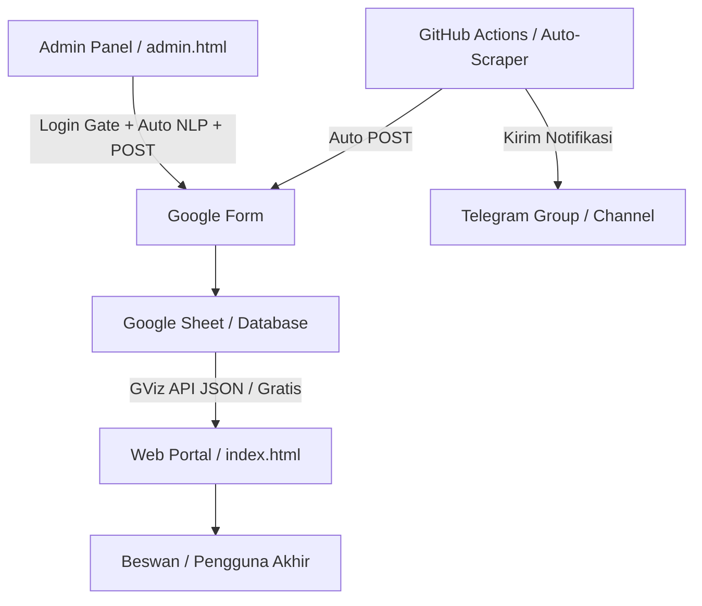

# 🎓 KSEUNRIPEDIA - Portal Info Lomba KSE UNRI

[](http://makeapullrequest.com)
[](https://opensource.org/licenses/MIT)
[](https://html.spec.whatwg.org/)
[](https://www.w3.org/Style/CSS/)
[](https://developer.mozilla.org/en-US/docs/Web/JavaScript)
[](https://www.python.org/)

**KSEUNRIPEDIA** adalah platform portal informasi terlengkap yang dirancang khusus untuk mempermudah mahasiswa (terutama Beswan Karya Salemba Empat Universitas Riau / KSE UNRI) dalam mencari dan membagikan informasi mengenai kompetisi (lomba), beasiswa, magang, lowongan kerja (loker), dan seminar secara real-time.

Platform ini menggunakan integrasi unik antara website frontend yang modern, bot scraping Python otomatis untuk mencari info lomba terbaru, serta Google Sheets sebagai database yang gratis dan mudah dikelola tanpa batas limitasi API berbayar.

---

## 🗺️ Arsitektur Sistem

Platform ini dirancang dengan alur data yang sederhana namun sangat efisien:



1. **Input Data**: Data masuk melalui dua jalur:
   * **Otomatis**: Bot Python (yang berjalan di GitHub Actions) men-scrape situs penyedia info lomba, mendeteksi kategori kegiatan secara cerdas, mengirimkan data via POST ke Google Form, serta mengirimkan notifikasi ke Telegram.
   * **Manual**: Admin menginput melalui Admin Panel (`admin.html`) dilengkapi parser berbasis NLP cerdas dan dilindungi gerbang keamanan login.
2. **Penyimpanan**: Google Form meneruskan data ke **Google Sheet** sebagai database utama.
3. **Penyajian**: Halaman portal utama (`index.html`) mengambil data langsung dari Google Sheet melalui **Google Visualization API (GViz)** secara asinkron (fetch) lalu menampilkannya secara interaktif dengan sistem pembagian halaman (pagination).

---

## 🌟 Fitur Utama

### 1. 📱 Portal Utama (`index.html`)
* **Desain UI/UX Modern & Responsif**: Tampilan clean dengan card layout yang dinamis, nyaman dibaca baik di desktop maupun perangkat mobile.
* **Pemuatan Bertahap (Pagination)**: Hanya memuat **9 lomba per halaman** untuk kecepatan muat website yang super gegas meskipun data sudah mencapai ratusan baris.
* **Sistem Bookmark / Favorit (Local Storage)**: Pengguna dapat menandai lomba favorit mereka, yang tersimpan aman secara permanen di browser lokal, serta melihat daftarnya melalui tab khusus "Favorit".
* **Berbagi Info Lomba (Share System)**: Tombol bagikan instan ke WhatsApp, Telegram, dan Twitter dengan format pesan Markdown yang rapi dan terstruktur lengkap dengan emoji menarik.
* **Sistem Filter & Kategori Cerdas**: Filter info berdasarkan kategori (Lomba, Beasiswa, Magang, Seminar, Karir), status pendaftaran (Buka, Segera, Tutup), dan kolom pencarian yang responsif (*debounced search*).
* **Indikator Urgensi (Urgency Badge)**: Memberikan tanda visual khusus seperti `🚨 BESOK TUTUP!`, `⏰ TUTUP SEGERA`, atau `🔥 BURUAN!` untuk membantu pengguna tidak melewatkan tenggat waktu pendaftaran.
* **Modal Detail Interaktif**: Lihat detail deskripsi, manfaat (benefit), penyelenggara, biaya pendaftaran, kontak narahubung, serta tombol langsung menuju link resmi pendaftaran.

### 2. 🛠️ Panel Admin & Parser Teks (`admin.html`)
* **Gerbang Keamanan Login**: Mengamankan halaman admin menggunakan autentikasi sederhana bagi Divisi KSE (`DIKLAT2026` / `kakhikmacantik`) berbasis `sessionStorage`.
* **Penginputan Berbasis AI/NLP Sederhana**: Cukup salin dan tempel (copy-paste) teks deskripsi lomba yang berantakan dari grup WhatsApp atau poster. Sistem akan mengekstrak informasi penting secara otomatis seperti judul, penyelenggara, tanggal pendaftaran, hingga kontak narahubung.
* **Integrasi Langsung & Auto-Approve**: Data yang diinputkan dari panel admin akan langsung tersimpan di Google Sheet dan otomatis tayang langsung di website beranda.

### 3. 🤖 Bot Scraper & Otomatisasi (`py/scraper_kabarlomba.py` & Actions)
* **Kategorisasi Otomatis Cerdas**: Mengenali jenis kegiatan secara otomatis (apakah masuk Lomba, Beasiswa, Seminar, Magang, atau Lowongan Kerja) berdasarkan pencocokan teks pintar.
* **Notifikasi Telegram Instan**: Mengirimkan notifikasi pesan informatif langsung ke Telegram chat/grup pengelola sesaat setelah lomba berhasil disimpan ke database.
* **GitHub Actions Workflow**: Scraping didelegasikan otomatis ke GitHub Actions untuk berjalan setiap 12 jam sekali, lengkap dengan skema komit mandiri berkas `scraped_history.json` untuk menjaga sinkronisasi *history* secara gratis.
* **Scraping Konkuren (Multi-threaded)**: Menggunakan `ThreadPoolExecutor` untuk memproses banyak artikel secara bersamaan dengan cepat dan efisien.
* **Ekstraksi Berbasis AI (Gemini)**: Jika API Key Gemini tersedia, bot akan memproses deskripsi lomba menggunakan Model AI Gemini untuk akurasi data yang super presisi. Jika tidak, sistem akan otomatis melakukan fallback ke parser regex yang tangguh.
* **Sistem Anti-Duplikasi (History)**: Menyimpan riwayat artikel yang sudah discrape ke dalam `scraped_history.json` untuk menghindari pengiriman data ganda.

---

## 💻 Tech Stack

* **Frontend**: HTML5, Vanilla CSS3 (Custom Variables, Flexbox/Grid, Animations), JavaScript ES6+ (Fetch API, DOM Manipulation)
* **Backend & Database**: Google Sheets & Google Forms (Bypass API limit via Google Visualization API)
* **Automation**: Python 3.x, Requests, BeautifulSoup4, Urllib3, ThreadPoolExecutor, Google Gemini API (opsional)

---

## 🚀 Panduan Memulai (Instalasi & Penggunaan)

### 1. Menjalankan Website (Lokal)
Website ini dibangun tanpa memerlukan build step atau framework rumit (Zero Setup).
1. Clone repositori ini:
   ```bash
   git clone https://github.com/zidanLPTP/info-lomba-kse.git
   cd info-lomba-kse
   ```
2. Jalankan berkas `index.html` menggunakan local server seperti **Live Server** di VS Code, atau cukup buka berkas langsung di browser Anda.

### 2. Menjalankan Python Scraper (Otomatisasi)
Untuk menjalankan bot pencatat lomba otomatis:
1. Pastikan Anda memiliki Python 3.x terinstal.
2. Install dependensi yang diperlukan:
   ```bash
   pip install requests beautifulsoup4
   ```
3. *(Opsional)* Jika ingin mengaktifkan pemrosesan pintar dengan AI Gemini, buat environment variable `GEMINI_API_KEY`:
   ```bash
   # Windows PowerShell
   $env:GEMINI_API_KEY="kunci-api-gemini-anda"
   
   # Linux/macOS
   export GEMINI_API_KEY="kunci-api-gemini-anda"
   ```
4. Jalankan script scraper:
   ```bash
   python py/scraper_kabarlomba.py
   ```

---

## ⚙️ Kustomisasi Database Google Sheet

Jika Anda ingin menghubungkan platform ini ke Google Sheet Anda sendiri:
1. Buat Google Form baru dengan input kolom yang sesuai dengan parameter form pada berkas `js/admin-parser.js` dan `py/scraper_kabarlomba.py`.
2. Hubungkan Google Form tersebut ke Google Sheet untuk menampung respon.
3. Atur Google Sheet Anda agar dapat diakses oleh siapa saja yang memiliki link (**"Anyone with the link can view"** / **"Siapa saja yang memiliki link dapat melihat"**).
4. Ambil **ID Google Sheet** Anda dari URL spreadsheet:
   `https://docs.google.com/spreadsheets/d/[ID_GOOGLE_SHEET_ANDA]/edit`
5. Buka berkas [js/config.js](file:///d:/DIKLATxKOMINFO/js/config.js) dan perbarui properti berikut:
   ```javascript
   GOOGLE_SHEET: {
       SHEET_ID: 'ID_GOOGLE_SHEET_ANDA',
       SHEET_NAME: 'Nama Sheet Anda (e.g. Form Responses 1)'
   }
   ```
6. Sesuaikan link action submit form `FORM_URL` pada [js/admin-parser.js](file:///d:/DIKLATxKOMINFO/js/admin-parser.js) dan [py/scraper_kabarlomba.py](file:///d:/DIKLATxKOMINFO/py/scraper_kabarlomba.py) dengan URL form response milik form Anda.

---

## 📝 Lisensi

Proyek ini dilisensikan di bawah **MIT License** - lihat berkas [LICENSE](LICENSE) untuk detail lebih lanjut.

---

## 🤝 Kontribusi

Kontribusi selalu diterima dengan senang hati!
1. Fork repositori ini.
2. Buat branch fitur baru (`git checkout -b fitur-baru`).
3. Commit perubahan Anda (`git commit -m 'Menambahkan fitur baru yang luar biasa'`).
4. Push ke branch tersebut (`git push origin fitur-baru`).
5. Buat Pull Request.

---
*Dibuat dengan ❤️ oleh Divisi Pendidikan & Pelatihan - Paguyuban Karya Salemba Empat Universitas Riau.*
